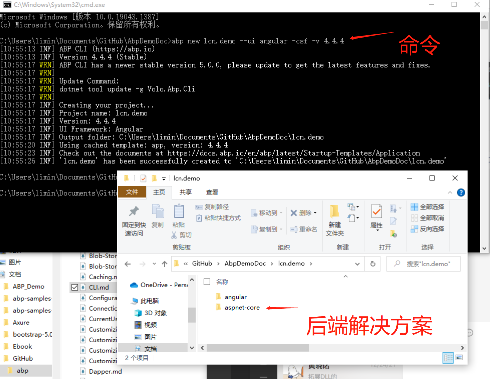

# 生成解决方案
前置条件：
1. 已经安装了NET5的SDK在[vs2019](https://visualstudio.microsoft.com/thank-you-downloading-visual-studio/?sku=professional&rel=16&utm_medium=microsoft&utm_source=docs.microsoft.com&utm_campaign=download+from+relnotes&utm_content=vs2019ga+button)专业版序列号**NYWVH-HT4XC-R2WYW-9Y3CM-X4V3Y**可以一起安装的也可以独立安装下载地址[NET5](https://dotnet.microsoft.com/en-us/download/dotnet/5.0)
2. 使用dotnet命令安装volo.abp.cli工具   
打开**cmd** 输入    
````bash
dotnet tool install -g Volo.Abp.Cli
````    
则会安装一个全局的dotnet工具了。    
生成解决方案    
建立一个文件夹，在cmd命令里面进入到该文件夹 
输入    
````bash
abp new lcn.demo --ui angular -csf -v 4.4.4
````    
其中lcn.demo是该解决方案的名称  
参数--ui是指定界面使用angular（后端指定使用WEBAPI而已） 
参数 -csf 意思是在当前建立一个文件夹**lcn.demo**包含了前端和后端（aspnetcore）的解决方案    
参数 -v 是指定版本，其中4.4.4是最后一个用到NET5的版本，之后就是NET6了   


