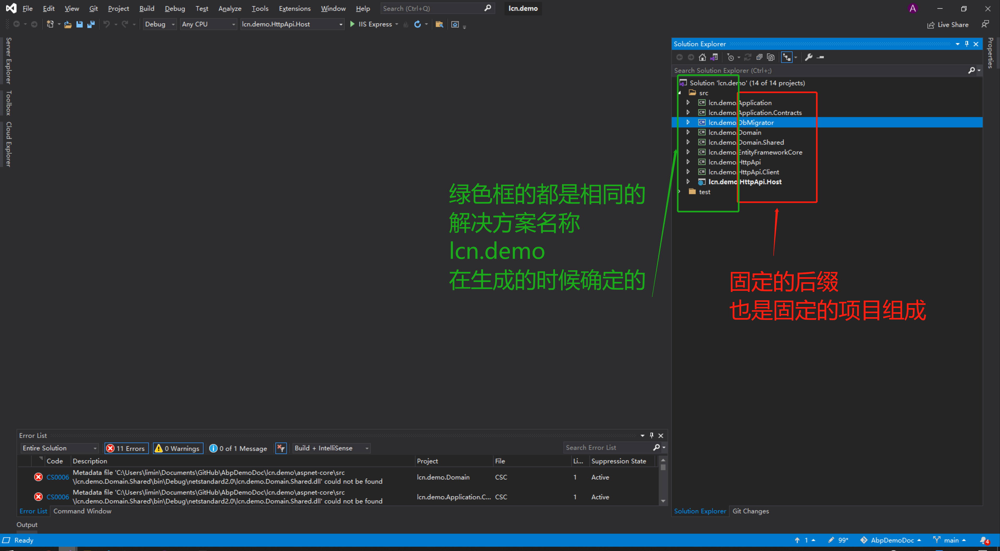
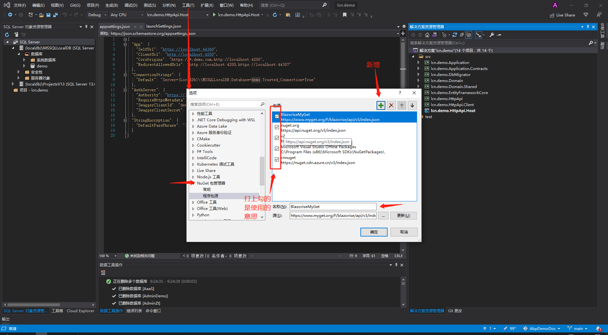
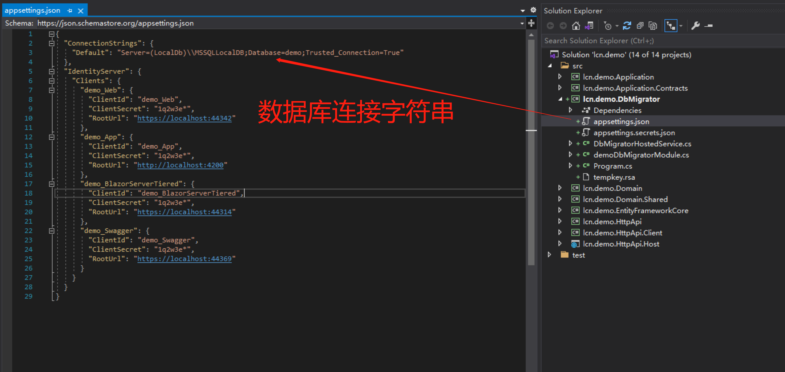
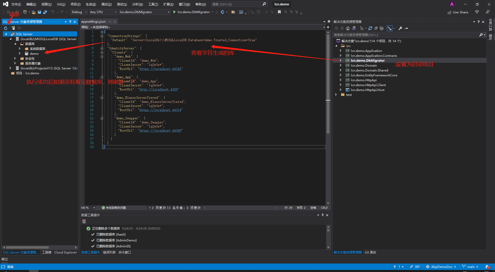
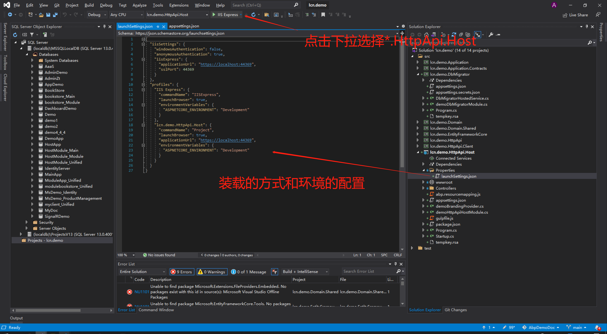
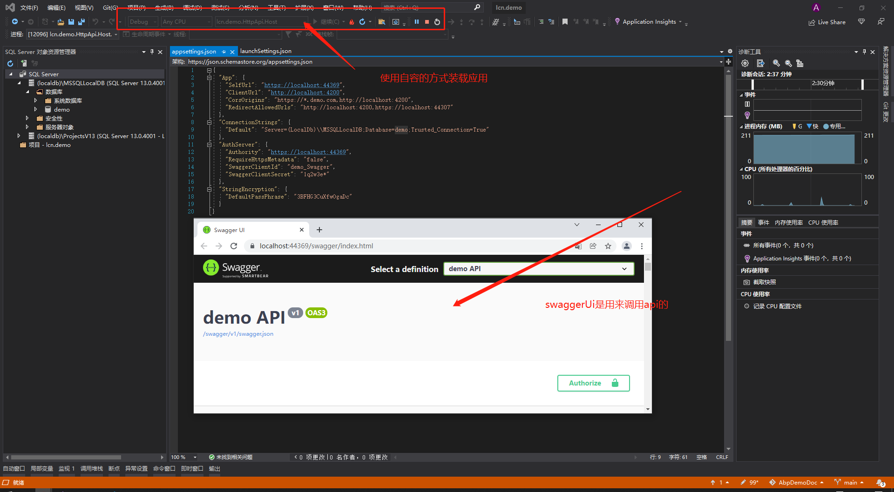

# 运行方案的步骤
打开lcn.demo.sln解决方案后，在解决方案资源里面能看见该方案包含的所有项目，其项目名由解决方案名称加上特定用途的项目名后缀组成
 
首先需要还原nuget包，按F6或者右击解决方案进行生成，一般都能还原包，如果失败，可以尝试添加nuget包的源。（一般自动运行也会自动还原的）      
https://www.nuget.org/api/v2/   
https://nuget.cdn.azure.cn/v3/index.json   
VS2019》工具》选项》NuGet包管理器》程序包源 如图示添加源后再运行，确定要***打勾***。
## 生成数据库
正常还原后（可以跳过该步骤），先设置项目lcn.demo.DbMigrator为启动项目，按下F5运行。该项目的作用是生成一个本地mdf的数据库，用于开发使用。其字符串配置在项目的appsetting.json文件里面。

具体的数据库mdf存放位置，在SQL SERVER对象浏览器里面（用快捷键 先按ctrl+\,再按ctrl+s）点开SQL SERVER，一般在第一个节点，(localdb)\MSSQLLocalDB里面，查看对应的属性就知道文件放哪里了。需要注意的是这个是开发使用的，别想着拷贝去正式环境里面使用。

*.DbMigrator项目的作用就是生成开发环境的数据库和持续部署正式环境时候使用，如果使用了这个控制台应用来持续更新数据库表结构，则不能再偷偷去数据库直接做修改，如果数据库表和该控制台应用不一致的时候就会出错了。    
**其中\*号代表的是解决方案的名称，当前是*lcn.demo*下同，不再提示！！！**
## 运行应用
如果正常生成数据库后就可以运行应用了。  
设置lcn.demo.HttpApi.Host项目为启动项目，这个项目也有一个appseting.json配置文件，和上面的应用一样，也存放有连接数据库的字符串，还有其他的一些配置。 
这个项目*.HttpApi.Host不同之处在于这是一个asp.net mvc 项目，可以用iisexpress运行也可以用控制台的方式运行，我们一般使用控台的方式运行，因为可以查看实时打印日志。在运行的图标那里选择运行的方式（先设置为启动项目）
接下来按F5或点击调试，正确运行的话应该能看见一个控制台打开，同时自动启动浏览器打开swaggerUI的页面    
那么说明项目运行成功了。

    完。
