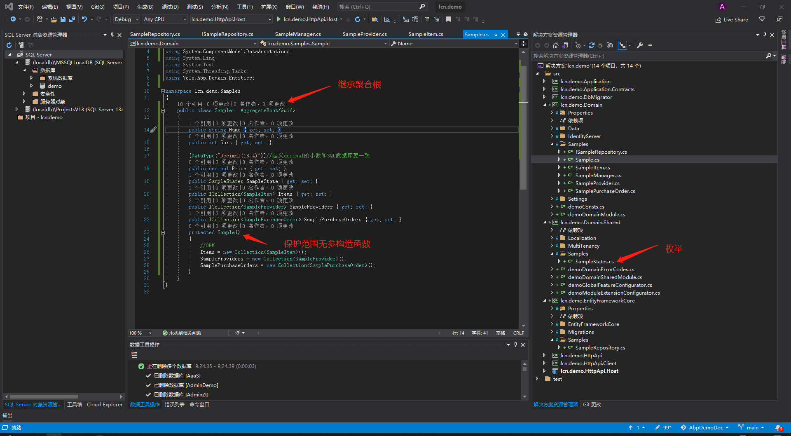
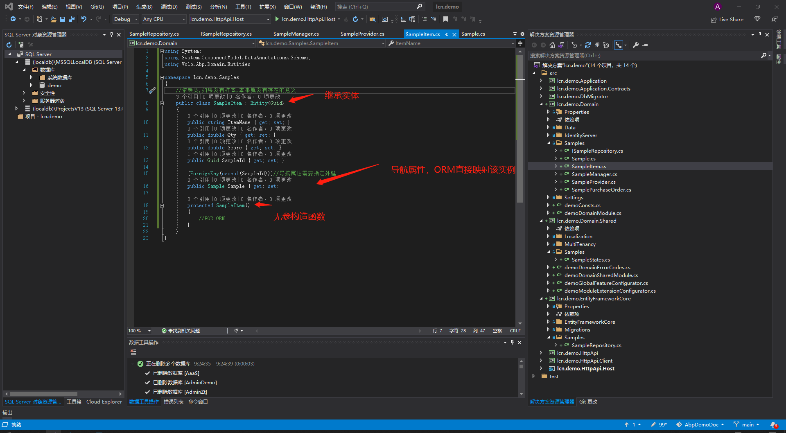

# 添加一个类
首先看看整个解决方案的项目其后缀代表的意思其中\*号代表解决方案名称***lcn.demo***
1. *.Application 应用层,主要实现业务逻辑,是一个**类库**
2. *.Application.Contracts 接口层，主要存放应用层所用到的接口，不能存放任何逻辑。类库
3. *.DbMigrator 用于建立、迁移、更新数据库是一个辅助控制台**应用**
4. *.Domain 领域层（模型层）主要存放实体类、自定义仓储接口 是一个类库
5. *.Domain.Shared 领域层的补充层，主要存放领域层用到的一些枚举和本地化语言资源的类 是一个类库
6. *.EntityFrameworkCore ORM层，是主要实现了EF对关系型数据库（SQLSERVER,MYSQL,OLREACE等）的操作 是一个类库
7. *.HttpApi  提供webapi，主要是实现MVC模式里面控制器 是一个类库
8. *.HttpApi.Client 模拟客户端，用于模拟用户操作 是一个类库（暂时用不上）
9. *.HttpApi.Host 主控制台应用 主要应用上面提到的项目，承载服务 是一个控制台应用
***搞那么多，其实也可以看成是以前的三层结构的再细分，把一些辅助的功能再分离而已。***
那么接下来，要添加的类就要根据具体用途放到对应的项目里面    
## 添加实体类例子
添加一个样本类，样本有很多检验项，样本也有供应商和对应的单据。  
所以样本类对检验项是一对多，样本类对供应商是多对多。 
样品类 sample   
检验项 sampleitem   
供应商 sampleprovider   
样品单 samplepurchaseorder  
其中因为检验项类依赖于样本类,所以样本类是一个聚合根类,因为有类依赖它,同时,检验项类不应该直接操作CRUD,应该由样本类执行.  
1. 在*.Domain层里面添加一个samples(样本复数)文件夹,这里使用了命名空间作为文件归类的 
2. 右击该文件夹分别添加上述的类文件,其中有个样本状态的枚举应该放在*.domain.shared层里面,同样需要新建一个samples文件夹,这样sample类使用该枚举的时候就不需要添加命名空间了.
3. 需要注意的样本类是聚合根类继承AggregateRoot类,类的主键是名字为ID的Guid类型的字段,由泛型传递AggregateRoot<Guid>,而检验项是必须依赖于样本类的,所以继承Entity类,同样其主键也是通过泛型传递Entity<Guid>.当然,也可以使用其他数据类型作为主键,只是领域设计里面最佳实践是使用Guid
4. 所有的类都必须提供一个访问范围是保护的无参构造函数,为了让ORM从数据库赋值给实例.***不能***是私有的.

