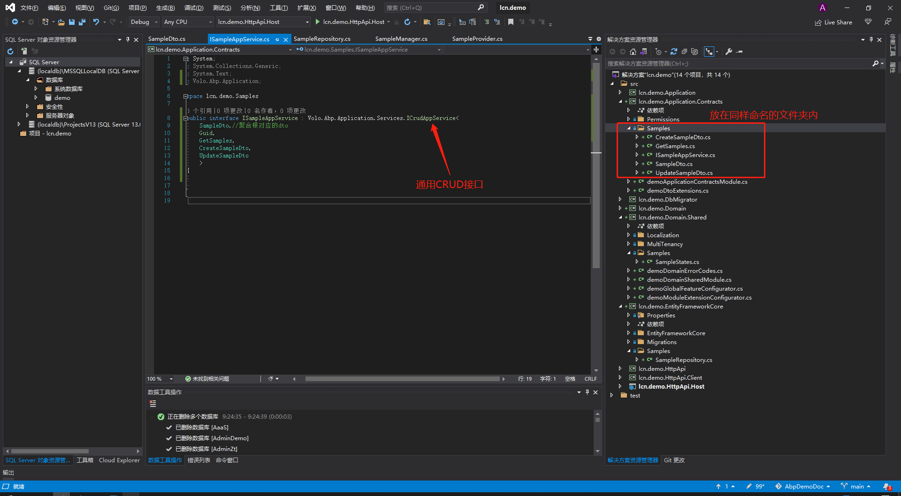

# 添加CRUD操作
注意,实体类是不应该提供CRUD的!由其依赖的聚合根类操作.   
下面为样本类添加基本的CRUD方法.这也算是简单的业务逻辑,所以应该放在应用层.首先添加一个samples文件夹到*.application.contracts项目,然后添加应用接口ISampleAppService***注意，凡是接口使用大写I开头是默认的约定***.该接口继承通用CRUD接口Volo.Abp.Application.Services.ICrudAppService<聚合根Dto,主键，查询dto,创建dto,更新dto>.可以看见接口的泛型参数里面都是传递一个***Dto（数据传输对象的英文缩写，这种类只有属性没有其他逻辑方法的）***
 
接着再在*.Application层添加文件夹samples，再添加应用服务SampleAppService,需要注意的是文件名和接口一样使用AppService后缀作为标识能直观表达出这是一个应用服务。   
这个应用服务需要继承